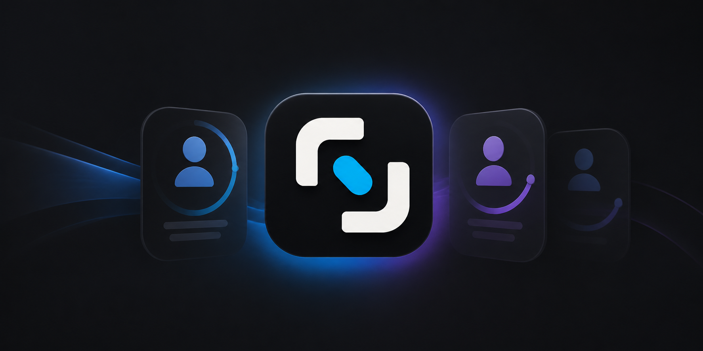

<a id="readme-top"></a>

<p align="center">
  
</p>

<h1 align="center">SwitchAI</h1>

<p align="center">
  Переключайте аккаунты. Следите за лимитами. Храните всё в одном месте.
</p>

<p align="center">
  <a href="README.md">English</a> · <strong>Русский</strong><br>
  <a href="https://github.com/vezlin1/SwitchAI-Account-Manager/releases/latest"><strong>Скачать</strong></a>
  · <a href="#как-это-работает">Как это работает</a>
  · <a href="docs/PRIVACY.ru.md">Конфиденциальность</a>
  · <a href="docs/TROUBLESHOOTING.ru.md">Помощь</a>
</p>

<p align="center">
  
  
  
  
  
</p>

SwitchAI — приложение для управления аккаунтами **ChatGPT/Codex** и
**Antigravity/Gemini**. Добавьте аккаунты один раз, смотрите доступные лимиты и
переключайтесь между ними без ручного копирования файлов авторизации.

Приложение бесплатное, с открытым исходным кодом и не требует отдельного
аккаунта SwitchAI.

## Зачем нужен SwitchAI

| Все аккаунты вместе | Лимиты перед глазами | Простое переключение |
| --- | --- | --- |
| Аккаунты ChatGPT/Codex и Google собраны в одном приложении и разделены по сервисам. | Видны доступные лимиты, время обновления, подписка и состояние входа. | Выберите аккаунт — SwitchAI сам обновит нужные локальные файлы авторизации. |

SwitchAI также подсказывает рабочий аккаунт с наиболее подходящим остатком
лимита, обновляет данные в фоне и остаётся доступным через системный трей.

## Скачать

Последняя версия доступна в разделе
[GitHub Releases](https://github.com/vezlin1/SwitchAI-Account-Manager/releases/latest).

### Windows

1. Скачайте `SwitchAI.exe`.
2. Откройте файл.
3. Добавьте аккаунт и завершите вход в браузере.

Поддерживается: **Windows 10 и 11, x64**.

### macOS

1. Скачайте файл `.dmg`.
2. Откройте его и перенесите SwitchAI в папку **Applications**.
3. Запустите SwitchAI и добавьте первый аккаунт.

Поддерживается: **macOS 11 и новее**, Apple Silicon и Intel.

Файлы релиза сопровождаются контрольными суммами SHA-256 и подписываются, когда
для платформы настроен сертификат.

## Как это работает

1. Откройте раздел **Codex** или **Antigravity**.
2. Нажмите **Add account** или **Sign in with Google**.
3. Завершите обычный вход у выбранного сервиса в браузере.
4. Выберите аккаунт и нажмите **Switch**.

SwitchAI обновит локальный вход выбранного сервиса. При необходимости
приложение перезапустит Codex или выбранное приложение Antigravity, чтобы новый
аккаунт сразу начал использоваться.

Если вы уже вошли в Antigravity, используйте **Import current session** —
повторно добавлять тот же Google-аккаунт не придётся.

## Возможности

- Управление несколькими аккаунтами ChatGPT/Codex и Antigravity/Gemini.
- Переключение без ручного редактирования файлов.
- Просмотр реальных периодов лимитов, которые вернул сервис.
- Данные подписки, время обновления и предупреждения о повторном входе.
- Обновление одного или всех аккаунтов вручную либо по расписанию.
- Поиск, изменение порядка и фильтрация аккаунтов по подписке.
- Выбор приложений Antigravity, в которых нужно сменить аккаунт.
- Быстрый просмотр состояния и фоновое обновление через системный трей.
- Восстановление данных из резервной копии при повреждении файла.

## Конфиденциальность и безопасность

SwitchAI хранит управление аккаунтами на вашем компьютере:

- у проекта нет облачного аккаунта SwitchAI и собственной телеметрии;
- токены хранятся в зашифрованном локальном хранилище;
- ключ защищён через Windows Credential Manager или macOS Keychain;
- защищённые токены не передаются в окно приложения;
- сетевые запросы идут напрямую OpenAI/ChatGPT, Google или службе
  дополнительной проверки доступности;
- файлы состояния сохраняются с резервной копией и возможностью
  восстановления.

Подробнее: [Конфиденциальность](docs/PRIVACY.ru.md) и
[Безопасность](SECURITY.ru.md).

## Важно знать

- SwitchAI — независимый открытый проект, не связанный с OpenAI или Google.
- Приложение не обходит правила сервисов, региональные ограничения и лимиты
  подписки.
- Некоторые данные о лимитах или подписке могут отсутствовать, если сервис не
  возвращает их для конкретного аккаунта.
- Удаление аккаунта из SwitchAI не всегда отзывает уже открытую сессию у
  сервиса. При необходимости отзовите доступ в настройках безопасности самого
  сервиса.

## Помощь и документы

- [Решение проблем](docs/TROUBLESHOOTING.ru.md)
- [Конфиденциальность](docs/PRIVACY.ru.md)
- [Безопасность](SECURITY.ru.md)
- [Журнал изменений](CHANGELOG.ru.md)
- [Сообщить о проблеме](https://github.com/vezlin1/SwitchAI-Account-Manager/issues/new)

<details>
<summary><strong>Сборка из исходного кода</strong></summary>

### Что потребуется

- Node.js 24
- актуальная стабильная версия Rust
- инструменты сборки для Tauri под вашу систему

### Локальный запуск

```bash
git clone https://github.com/vezlin1/SwitchAI-Account-Manager.git
cd SwitchAI-Account-Manager
npm ci
npm --prefix ui ci
npm run dev
```

### Сборка релиза

```powershell
# Windows
npm run build:release
```

```bash
# Универсальная сборка для macOS
npm run build:mac:universal
```

### Проверки

```bash
npm --prefix ui run lint
npm --prefix ui run test:quota
cargo test --locked --manifest-path src-tauri/Cargo.toml
```

</details>

## Лицензия

SwitchAI распространяется по лицензии [MIT](LICENSE).
